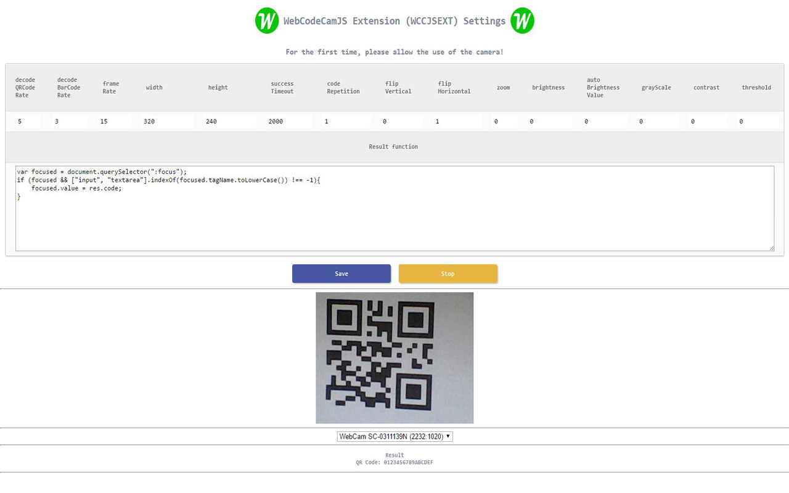

# WebCodeCamJS Chrome Extension

    The popular [WebCodeCamJS] as a chrome extension.
    Use WebCodeCamJS on ewery web pages with minimal coding.

Version
----

1.0.0

    - Detailed description coming soon...
    - [Homepage]

#

#

#

#

#

Included decoders
-----------
- barcode decoder ([DecoderWorker.js])
- qr-decoder ([qrcodelib.js])

License
----

MIT

Author: Tóth András
---
http://atandrastoth.co.uk/

2016-04-06

[Homepage]:http://atandrastoth.co.uk/main/pages/plugins/webcodecamjs/
[WebCodeCamJS]:https://andrastoth.github.io/webcodecamjs/
[DecoderWorker.js]:https://github.com/EddieLa/BarcodeReader
[qrcodelib.js]:https://github.com/LazarSoft/jsqrcode
