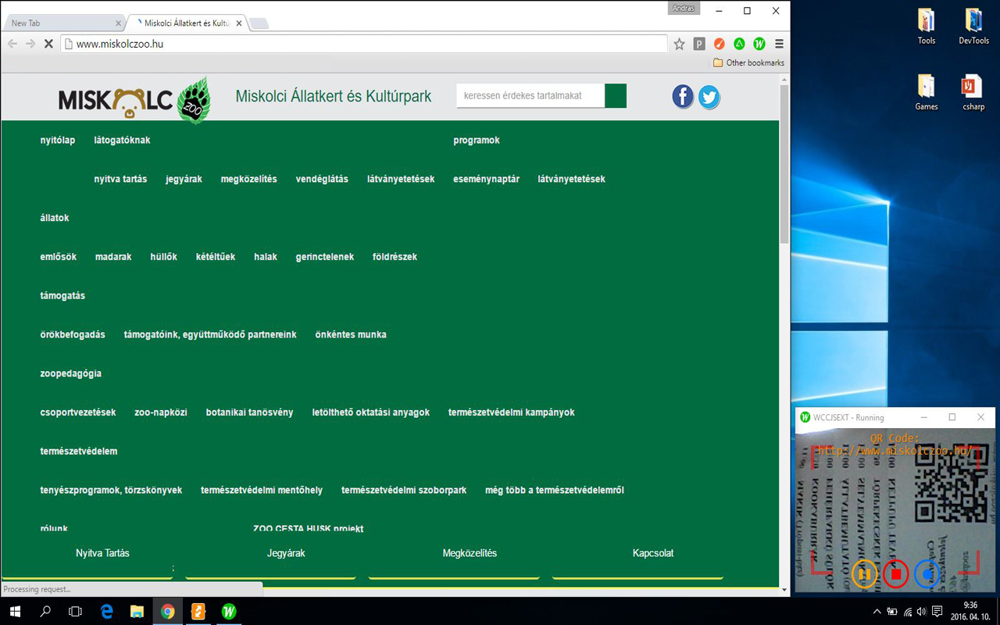

#  WebCodeCamJS Chrome Extension

### The popular [WebCodeCamJS] as a chrome extension.
Use WebCodeCamJS on ewery web pages with minimal coding.

[chrome web store]

Version
----

1.1.0

- Add new icon to ViewFinder
	- grey inactive: standard working
	- blue active: if code is url, open url in new tab
- Options
    - decode QRCode Rate: min=0 max=15 step=1 default=5/sec
    - decode BarCode Rate: min=0 max=15 step=1 default=3/sec
    - frame Rate: min=1 max=30 step=1 default=15/sec
    - width: default=320 px
    - height: default=240 px
    - success Timeout: min=0 max=10000 step=1 default=500 ms
    - code Repetition: min=0 max=1 step=1 default=0 (off)
    - flip Vertical: min=0 max=1 step=1 default=0 (off)
    - flip Horizontal: min=0 max=1 step=1 default=0 (off)
    - zoom: min=0 max=5 step=0.1 default=0 (auto)
    - brightness: min=0 max=256 step=1 default=0 (off)
    - auto Brightness value: min=0 max=256 step=1 default=0 (off)
    - grayScale: min=0 max=1 step=1 default=0 (off)
    - contrast: min=-128 max=128 step=1 default=0 (off)
    - threshold: tmin=0 max=1024 step=1 default=0 (off)
    - Result function: code to inject (default: focused input or textarea)

- [Homepage]
- [WebCodeCamJS]

###### Popup:

###### Options (Settings):

###### Write text to page using ViewFinder:

###### Open link using ViewFinder:

Included decoders
-----------
- barcode decoder ([DecoderWorker.js])
- qr-decoder ([qrcodelib.js])

License
----

MIT

Author: Tóth András
---
http://atandrastoth.co.uk/

2016-04-06

[Homepage]:http://atandrastoth.co.uk/main/pages/plugins/webcodecamjs/
[WebCodeCamJS]:https://andrastoth.github.io/webcodecamjs/
[DecoderWorker.js]:https://github.com/EddieLa/BarcodeReader
[qrcodelib.js]:https://github.com/LazarSoft/jsqrcode
[chrome web store]:https://chrome.google.com/webstore/detail/webcodecamjs-extension/iakljebmlbbedbflhifhmkbfcbpkippl
